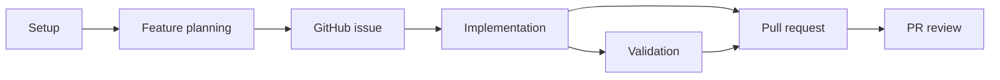

# DevFlow Skill

Portable Agent Skill for agile development workflows with GitHub integration. The skill is the product: Codex, Claude Code, and any other Agent Skills client are equally supported and behave identically.

## Installation

### Any Agent Skills Client (Codex, and others)

```bash
npx skills add https://github.com/docutray/devflow-skill --skill devflow
```

### Claude Code

Claude Code can install the skill the same way as above. The marketplace plugin installs that same skill and adds optional `/devflow:*` slash command shortcuts:

```bash
/plugin marketplace add docutray/devflow-skill
/plugin install devflow@docutray-skills
```

## Version

Current version: `2.1.0`

## What DevFlow Provides

DevFlow provides a structured workflow from research and planning through implementation, validation, and PR review.

### Standard Flow



## Example Usage

DevFlow is a skill, so you invoke it in natural language. This works the same in Codex, Claude Code, and any other Agent Skills client:

```text
Use DevFlow to configure this repository.
Use DevFlow to create a GitHub issue for adding invoice export.
Use DevFlow to implement issue #123 in an isolated worktree and run full validation.
Use DevFlow to review PR #45 and fix any blocking issues.
```

### Optional Claude Code Shortcuts

Installing the Claude Code plugin additionally registers namespaced slash commands. They are thin wrappers over the same skill and add no behavior, so they are entirely optional:

```bash
/devflow:devflow-setup
/devflow:feat add-invoice-export --type=feat --priority=high
/devflow:dev issue#123 --worktree --full-validation
/devflow:review-pr 45 --fix-issues
```

## Workflows

| Workflow | Description | Claude Code shortcut |
|---|---|---|
| Setup | Configure DevFlow for your project | `/devflow:devflow-setup` |
| Feature planning | Create feature specifications and GitHub issues | `/devflow:feat` |
| Implementation | Implement features from GitHub issues | `/devflow:dev` |
| Validation | Run parallel validations (tests, lint, types, build) | `/devflow:check` |
| PR review | Perform comprehensive PR reviews | `/devflow:review-pr` |
| Research | Research topics before planning | `/devflow:research` |
| Epic planning | Plan major initiatives with multiple phases | `/devflow:epic` |

Ask for a workflow by name in any client. The shortcuts exist only in Claude Code.

## Repository Structure

```
devflow-skill/
├── .claude-plugin/
│   └── marketplace.json      # Claude Code marketplace catalog
├── skills/
│   └── devflow/              # Canonical Agent Skill
│       ├── SKILL.md
│       ├── references/
│       └── assets/templates/
├── commands/                 # Claude Code slash command wrappers
└── README.md
```

## Local Development

```bash
# Clone the repository
git clone https://github.com/docutray/devflow-skill
cd devflow-skill

# Agent Skills local test
npx skills add . --skill devflow

# Claude Code local marketplace test
/plugin marketplace add .
/plugin install devflow@local
```

Validate manifests:

```bash
jq empty .claude-plugin/marketplace.json
```

If available, validate the Agent Skill:

```bash
skills-ref validate ./skills/devflow
```

## References

- [Agent Skills specification](https://agentskills.io/specification)
- [skills.sh documentation](https://skills.sh/docs)
- [Claude Code plugins](https://docs.claude.com/en/docs/claude-code/plugins)

## License

MIT

## Support

- **Issues**: [GitHub Issues](https://github.com/docutray/devflow-skill/issues)
- **Contact**: Roberto Arce (roberto@docutray.com)
