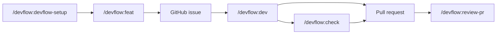

# DevFlow Skill

Portable Agent Skill for agile development workflows with GitHub integration. DevFlow works with skills-compatible agents via `npx skills` and keeps Claude Code slash commands through a compatibility plugin.

## Installation

### Agent Skills

```bash
npx skills add https://github.com/docutray/devflow-skill --skill devflow
```

### Claude Code

```bash
/plugin marketplace add docutray/devflow-skill
/plugin install devflow@docutray-skills
```

This installs the `devflow` skill and exposes compatibility slash commands such as `/devflow:feat`, `/devflow:dev`, `/devflow:check`, and `/devflow:review-pr`.

## Version

Current version: `2.0.0`

## What DevFlow Provides

DevFlow provides a structured workflow from research and planning through implementation, validation, and PR review.

### Standard Flow



```bash
# Claude Code command UX
/devflow:devflow-setup
/devflow:feat feature-name
/devflow:dev issue#123
/devflow:check
/devflow:review-pr 45
```

In Codex and other Agent Skills clients, ask naturally: "Use DevFlow to implement issue #123" or "Use DevFlow to review PR #45".

## Commands And Workflows

| Command | Description |
|---------|-------------|
| `/devflow:devflow-setup` | Configure DevFlow for your project |
| `/devflow:feat` | Create feature specifications and GitHub issues |
| `/devflow:dev` | Implement features from GitHub issues |
| `/devflow:check` | Run parallel validations (tests, lint, types, build) |
| `/devflow:review-pr` | Perform comprehensive PR reviews |
| `/devflow:research` | Research topics before planning |
| `/devflow:epic` | Plan major initiatives with multiple phases |

## Repository Structure

```
devflow-skill/
├── .claude-plugin/
│   └── marketplace.json      # Claude Code marketplace catalog
├── skills/
│   └── devflow/              # Canonical Agent Skill
│       ├── SKILL.md
│       ├── references/
│       └── assets/templates/
├── commands/                 # Claude Code slash command wrappers
└── README.md
```

## Local Development

```bash
# Clone the repository
git clone https://github.com/docutray/devflow-skill
cd devflow-skill

# Agent Skills local test
npx skills add . --skill devflow

# Claude Code local marketplace test
/plugin marketplace add .
/plugin install devflow@local
```

Validate manifests:

```bash
jq empty .claude-plugin/marketplace.json
```

If available, validate the Agent Skill:

```bash
skills-ref validate ./skills/devflow
```

## References

- [Agent Skills specification](https://agentskills.io/specification)
- [skills.sh documentation](https://skills.sh/docs)
- [Claude Code plugins](https://docs.claude.com/en/docs/claude-code/plugins)

## License

MIT

## Support

- **Issues**: [GitHub Issues](https://github.com/docutray/devflow-skill/issues)
- **Contact**: Roberto Arce (roberto@docutray.com)
